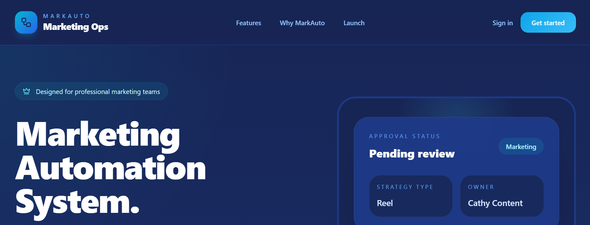
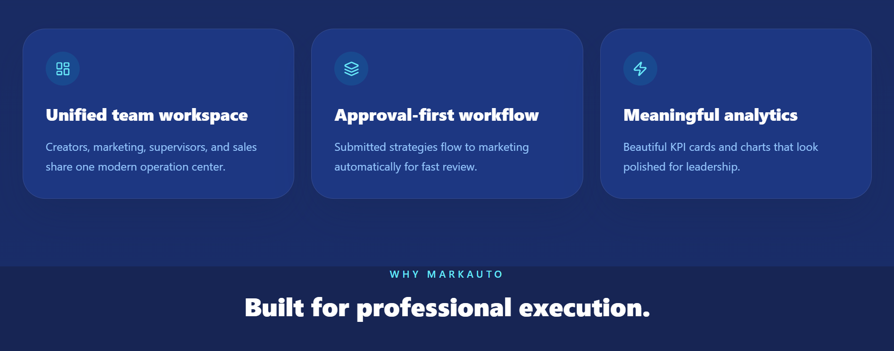
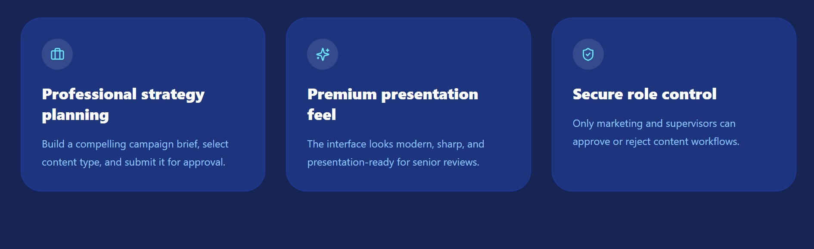

# 🚀 MarkAuto – Advanced Marketing Automation System

<h3 align="center">
Enterprise Marketing Workflow Platform
</h3>

<p align="center">
An advanced Marketing Automation System that streamlines campaign planning, budget approvals, content management, strategy execution, and lead generation through an intelligent role-based workflow.
</p>

<p align="center">


</p>

---

## 📸 Application Preview
<table align="center">
<tr>
<td></td>
<td></td>
<td></td>
<td></td>
<td></td>
</tr>
</table>
---

## 📖 About

MarkAuto is an **Advanced Marketing Automation System** developed to automate and simplify the complete marketing lifecycle through a centralized role-based workflow.

The platform enables organizations to efficiently manage campaigns, strategies, budget approvals, content creation, and sales operations while ensuring smooth collaboration between multiple departments.

The system includes five dedicated user roles that work together in a structured approval process, making marketing operations faster, organized, and more efficient.

---

## 🚀 Quick Highlights

- 👥 Five Dedicated User Roles
- 💰 Budget Approval Workflow
- 📈 Marketing Strategy Management
- 🎨 Content Creation & Scheduling
- 📢 Campaign Management
- 🤝 Sales Lead Generation
- 📬 Internal Messaging
- 📊 Analytics Dashboard
- 🔐 Secure Role-Based Authentication
- 🌐 Modern Responsive User Interface

---

# 👥 User Roles

## 👑 Admin

- Manage Users
- Assign Roles
- Manage Platforms
- Configure System Settings

---

## 👨‍💼 Supervisor

- Review Marketing Strategies
- Approve Budget Requests
- Reject Requests
- Send Counter Budget Proposals
- Monitor Team Activities

---

## 📈 Marketing Team

- Create Marketing Campaigns
- Develop Marketing Strategies
- Submit Budget Requests
- Track Campaign Progress

---

## 🎨 Content Creator

- Prepare Marketing Content
- Upload Campaign Assets
- Manage Content Schedule
- Review Content Quality

---

## 💼 Sales Team

- Generate Sales Leads
- Manage Customer Pipeline
- Track Revenue
- Analyze Sales Performance

---

# 🔄 System Workflow

```text
Marketing Team
       │
       ▼
Create Marketing Strategy
       │
       ▼
Submit Budget Request
       │
       ▼
Supervisor Review
       │
 ┌─────┼────────────┐
 │     │            │
 ▼     ▼            ▼
Approve Reject Counter
 │
 ▼
Content Creator
 │
 ▼
Campaign Execution
 │
 ▼
Sales Team
 │
 ▼
Lead Generation
 │
 ▼
Reports & Analytics
```

---

# 🖥️ System Modules

### 👑 Admin

- User Management
- Platform Management
- Site Content
- System Settings

### 📈 Marketing Team

- Marketing Campaigns
- Strategy Planning
- Budget Requests

### 👨‍💼 Supervisor

- Budget Approval
- Budget Counter Offers
- Strategy Review

### 🎨 Content Creator

- Content Scheduling
- Upload Media
- Strategy Management

### 💼 Sales Team

- Lead Management
- Revenue Tracking
- Sales Reports

### 🌐 Shared Modules

- Dashboard
- Profile
- Messages
- Support Center

---

# 🛠 Tech Stack

## Frontend

- React 18
- TypeScript
- Vite
- Tailwind CSS
- React Router DOM
- Recharts
- Lucide React

## Backend

- Node.js
- Express.js
- TypeScript

## Development Tools

- Git
- GitHub
- VS Code
- npm

---

# 📂 Project Structure

```text
MarkAuto
│
├── backend
│   ├── src
│   ├── routes
│   ├── controllers
│   └── package.json
│
├── public
│
├── src
│   ├── assets
│   ├── components
│   ├── context
│   ├── hooks
│   ├── pages
│   ├── types
│   └── utils
│
├── landingpg1.png
├── 2.png
├── 3.png
├── 4.png
├── 5.png
│
├── package.json
└── README.md
```

---

# 🚀 Installation

### Clone the repository

```bash
git clone https://github.com/laiba7826/MarkAuto-Marketing-Automation-System-.git
```

### Navigate to the project

```bash
cd MarkAuto-Marketing-Automation-System-
```

### Install dependencies

```bash
npm install
```

### Start the development server

```bash
npm run dev
```

### Build for production

```bash
npm run build
```

---

# 🎯 Future Enhancements

- 🤖 AI-powered Campaign Recommendations
- 📧 Email Marketing Automation
- 📱 Social Media Platform Integration
- ☁ Cloud Deployment
- 📊 Advanced Business Analytics
- 🔔 Real-Time Notifications
- 📈 Predictive Lead Scoring
- 📅 Campaign Performance Forecasting

---

# ⭐ Show Your Support

If you found this project useful, consider giving it a ⭐ on GitHub.

It motivates the team to continue improving the project and helps others discover it.

---

<p align="center">
Made with ❤️ using React, TypeScript, Node.js & Express
</p>
